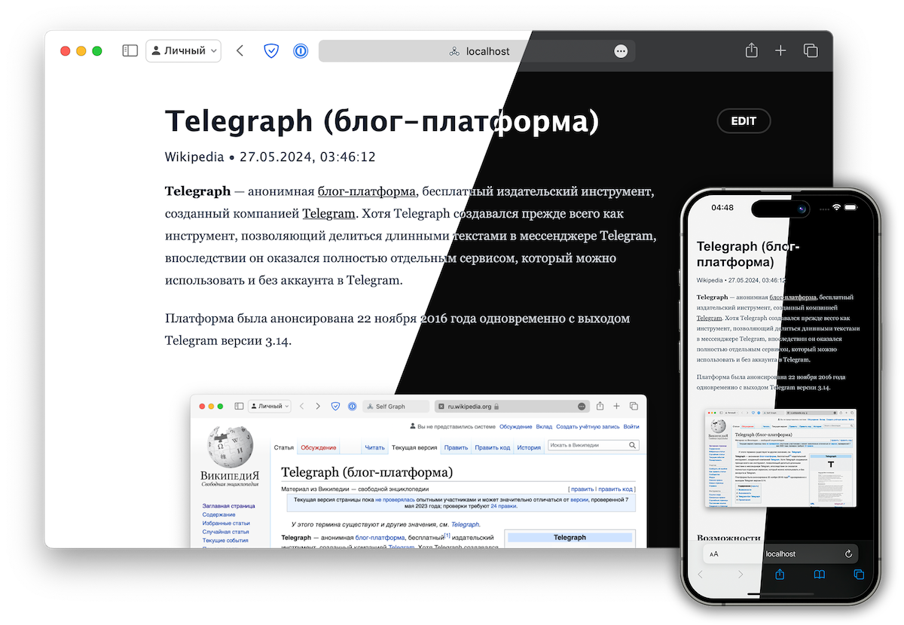

# Selfgraph

Enhanced, Open Source, self-hosted telegra.ph analog built on Vue.js 3

## Features

- Basic telegra.ph features:
  - Creating, editing, and viewing posts
  - Image uploading
  - Mobile and Desktop responsive UI
  - Nice post typography
- Enhanced features:
  - Dark mode support
  - Code syntax highlighting
  - Internationalization

Todo features:
- SEO support
- Content reporting
- YouTube video integration

## How it works

### [Frontend](https://github.com/selfgraph/web)

Stack:
- Vue.js 3
- Vite
- TypeScript
- [Selfgraph Editor component](https://github.com/selfgraph/editor)
  - Based on [TipTap](https://tiptap.dev), it provides a user-friendly content editor with a pretty UI
  - shadcn/ui ([shadcn-vue](https://www.shadcn-vue.com))
  - Tailwind CSS with Tailwind Typography

### [Backend](https://github.com/selfgraph/backend)

Uses the concept of Backend as a Service (BaaS), and employs [Supabase](https://supabase.com) to provide it.
